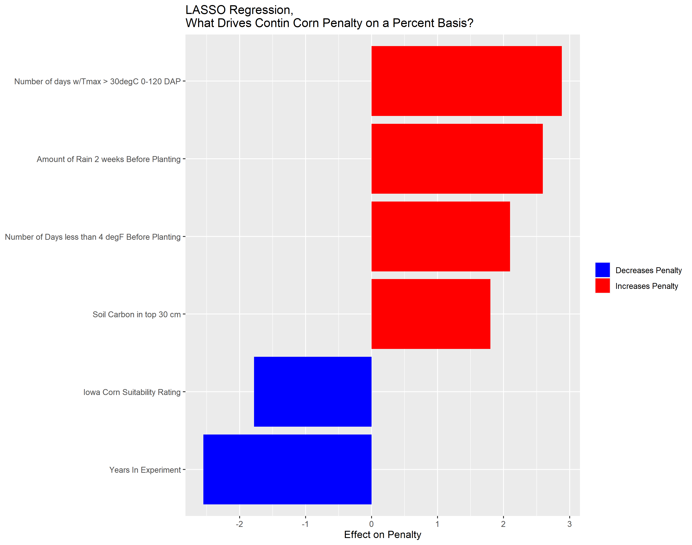
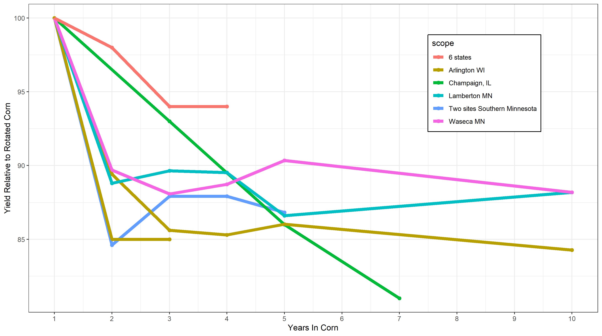
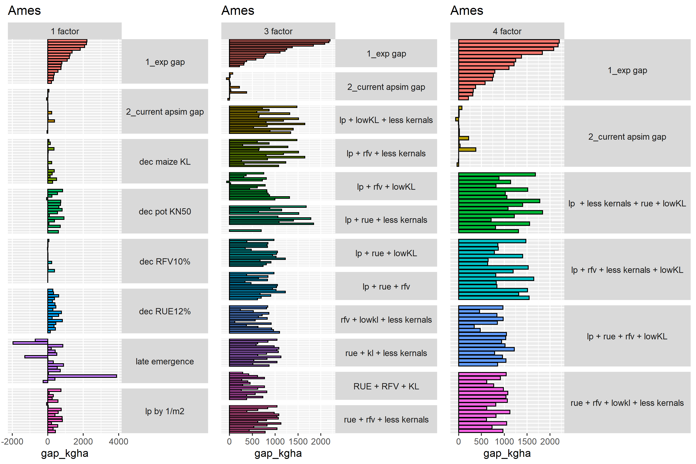
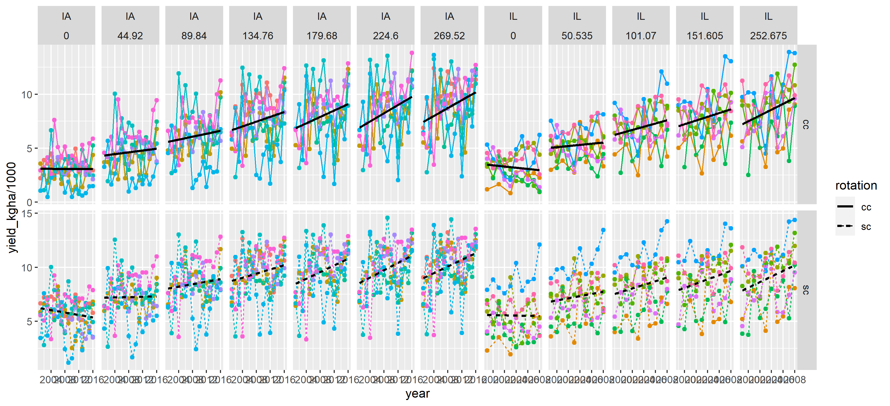

```{r setup, include=FALSE, message=FALSE, warning=FALSE}
knitr::opts_chunk$set(echo = FALSE, message = FALSE, warning = FALSE)
library(tidyverse)
library(tidysawyer2)
```

## Motivation

```{r motivation}

dat <- saw_tidysawyer %>% 
  dplyr::select(crop, site, year, rotation, nrate_kgha, yield_kgha) %>% 
  mutate(datatype = "experimental") %>% 
  bind_rows(saw_tidyapsim %>% 
              dplyr::select(-rotation) %>% 
              dplyr::rename(rotation = rotation2) %>% 
              mutate(datatype = "apsim"))

dat_seg <- 
  dat %>% 
  group_by(crop, nrate_kgha, rotation, datatype) %>%
  summarise(n = n(),
            yield_kgha = mean(yield_kgha, na.rm = TRUE)) %>% 
  group_by(crop, rotation, datatype) %>% 
  mutate(mx_nrate_kgha = max(nrate_kgha)) %>%
  ungroup() %>%
  filter(nrate_kgha == mx_nrate_kgha) %>% 
  mutate(rotation = recode(rotation,
                           "cc" = "Continuous Corn",
                           "sc" = "Soybean-Corn")) %>%
  dplyr::select(rotation, datatype, yield_kgha) %>% 
  pivot_wider(names_from = datatype, values_from = yield_kgha) %>% 
  mutate(nrate_kgha = 265)

dat %>%
  group_by(crop, nrate_kgha, rotation, datatype) %>%
  summarise(n = n(),
            yield_kgha = mean(yield_kgha, na.rm = TRUE)) %>%
  ungroup() %>%
  mutate(rotation = recode(rotation,
                           "cc" = "Continuous Corn",
                           "sc" = "Soybean-Corn")) %>%
  filter(n > 20) %>%
  ggplot(aes(nrate_kgha, yield_kgha/1000)) +
  geom_line(aes(color = datatype), size = 3) +
  geom_segment(data = dat_seg, aes(x = nrate_kgha,
                                   xend = nrate_kgha,
                                   yend = experimental/1000,
                                   y = apsim/1000),
               arrow = arrow(length = unit(0.1, "inches")),
               size = 1.5,
               color = "red") +
  scale_color_manual(values = c("apsim" = "darkred",
                                "experimental" = "deepskyblue")) +
  labs(x = "Nitrogen Rate (kg/ha)",
       y = "Yield (Mg/ha)",
       title = "Iowa Data",
       color = "Data Type") +
  theme_bw() +
  theme(legend.position = c(1,0),
        legend.justification = c(1,0),
        legend.background = element_rect(color = "black"),
        strip.text = element_text(size = rel(1.4)),
        axis.title = element_text(size = rel(1.2))) +
  facet_grid(. ~ rotation)


```

## Hypotheses and Objectives

**Objectives:**

- Use statistical models and experimental data to find environments associated with higher contin. corn penalties

- Use literature to identify physical manifestations of cont. corn penalty

- Use results to incorporate cont. corn yield penalty into APSIM algorithms

**Hypotheses:**

$H_1$ The continuous corn penalty is not random and can be captured and described by a process-based model. 
$H_0$ The penalty is related to biotic phenomena (disease) that cannot be captured by a process-based model that only captures abiotic processes. 

## Preliminary Approach, Iowa

- Gather variables
- Identify variables with sufficient variation
- Assess colinearity, eliminate highly correlated variables


## Resulting Iowa-based variables

Management-based

```{r vars setup, message=FALSE, warning=FALSE}
tab_dat <- read_csv("../01_create-features/cf_preds-all.csv")

library(gt)
library(psych)

dat_sum <- psych::describe(tab_dat)

dat_vars <- rownames(dat_sum)

dat_sum_tib <- 
  dat_sum %>%
  as_tibble() %>% 
  mutate(vars = dat_vars) %>% 
  dplyr::select(vars, min, max, mean) %>% 
  filter(!is.infinite(min)) %>% 
  mutate_if(is.numeric, round, 0)

#--make something explaining what each var is
dat_tab <- 
  dat_sum_tib %>% 
  mutate(vars_nice = recode(vars,
                            "year" = "Year of experiment",
                            "cgap_max" = "Cont. corn gap at max N rate",
                            "cgap_max_pct" = "Cont. corn gap at max N rate as % of SC yield",
                            "prev_ccyield" = "Prev year CC yield at max N rate\n (indicative of residue amount)",
                            "avg_yield" = "Avg yield at max N at that site",
                            "years_in_corn" = "Number of Years in Cont Corn",
                            "heatstress_n" = "# Days w/Tmax > 30oC from planting to 120 DAP (WEA)",
                            "ndays_gdd140" = "# Days after planting to acheive 140 GDDs (WEA)",
                            "p2wk_precip_mm_tot" = "Total Precip 2 weeks after planting (WEA)",
                            "prep2wk_precip_mm_tot" = "Total Precip 2 weeks before planting (WEA)",
                            "pre2wkp2wk_tl_mean" = "Mean low temp 4 weeks around planting (WEA)",
                            "wintcolddays_n" = "# of days < 4degF Jan 1 - planting (WEA)",
                            "p2mo_gdd" = "GDDs 0-2mo after planting (WEA)",
                            "iacsr" = "Iowa Corn Suitability Rating (SSURGO)",
                            "wtdepth_cm" = "Depth to Water Table (SSURGO)",
                            "bhzdepth_cm" = "Depth to B horizon (SSURGO)",
                            "clay_60cm_pct" = "0-60cm % clay (SSURGO)",
                            "soc_30cm_pct" = "0-30cm % organic carbon (SSURGO)",
                            "paw_150cm_mm" = "0-150cm plant-available-water (SSURGO)")
                            ) %>% 
  dplyr::select(vars_nice, mean, min, max) %>% 
  dplyr::rename(Variable = vars_nice)

ssurgo_tab <- 
  dat_tab %>% 
  filter(grepl("SSURGO", Variable))


wea_tab <- 
  dat_tab %>% 
  filter(grepl("WEA", Variable))


mgmt_tab <- 
  dat_tab %>% 
  filter(!grepl("WEA", Variable),
         !grepl("SSURGO", Variable))


```


```{r vars mgmt}


mgmt_tab %>% 
  gt() %>% 
  tab_header(
    title = "Management Variables Included In Models")


```

## Resulting Iowa-based variables

Weather-based

```{r vars wea}


wea_tab %>% 
  gt() %>% 
  tab_header(
    title = "Weather Variables Included In Models")

```


## Resulting Iowa-based variables

Soil-based


```{r vars ssurgo}


ssurgo_tab %>% 
  gt() %>% 
  tab_header(
    title = "Soil Variables Included In Models")


```


## What environments are associated with higher yield gaps in Iowa?

- Random forest models to identify important variables to include in regression analysis

- LASSO regression to quantify magnitude and direction of important associations

## Random forest model results

```{r rand for}

rf_imps <- read_csv("../02_fit-models/fm-rfpct-imp-loo.csv")

rf_imps %>%
  dplyr::group_by(feature) %>% 
  dplyr::summarise(imp = sum(imp)) %>% 
  ggplot(aes(reorder(feature, imp), imp)) +
  geom_segment(y = 0, aes(xend = feature, yend = imp)) + 
  geom_point(size = 7, aes(color = imp < 16)) + 
  coord_flip() + 
  guides(color = F) +
  scale_color_manual(values = c("darkred", "gray90")) +
  labs(title = "Random Forest Importance Scores, Iowa Data",
       y = "Importance Score",
       x = NULL) +
  theme_bw() +
  theme(legend.position = c(1,0),
        legend.justification = c(1,0),
        legend.background = element_rect(color = "black"),
        strip.text = element_text(size = rel(1.4)),
        axis.title = element_text(size = rel(1.2))) 

```

## LASSO regression results

```{r lasso, out.width ='90%', out.height= '60%'}

```

## Does the penalty increase over time?
Literature review, studies must not confound time in continuous corn with year
```{r, out.width='100%'}

```


## Summary of preliminary results (Iowa-based)

*Summary:*

- Cold wet springs and hot early growing seasons enhance rotation effect at high N rates
- Penalty is only sensitive to previous year's crop (number of years in corn not important)


## Possible targets in APSIM?

Don't worry about the acronyms, the point is the magnitude

```{r apsim, out.width='100%', out.height='100%'}


```

## APSIM targets

*Summary:*

- There are parameters that can be changed that, in combination, re-create the magnitude of the cont. corn penalty
- Creating an algorithm that adjusts these parameters based on soil/weather/management has the potential to capture the patterns


## Iowa and Illinois Yields Over Time

```{r yields, out.width='100%'}


```

## Closer look at the continuous corn yield gap

```{r yield gap}

saw_cgap %>% 
  mutate(state = "Iowa") %>% 
  filter(year > 2000) %>% 
  bind_rows(il_cgap %>% mutate(state = "Illinois")) %>% 
  group_by(state) %>% 
  mutate(mean_cgap = mean(cgap_max, na.rm = TRUE)) %>% 
  ggplot(aes(year, cgap_max/1000, group = site)) + 
  geom_hline(yintercept = 0) +
  geom_point(aes(color = state)) + 
  geom_line(aes(color = state)) +
  geom_hline(aes(yintercept = mean_cgap/1000), color = "red", size = 2) +
  facet_grid(.~state, scales = "free") +
  scale_color_manual(values = c("Illinois" = "purple",
                                 "Iowa" = "orange")) +
  guides(color = F) +
  theme_bw() + 
  labs(x = "Year",
       y = "Yield (Mg/ha)",
       title = "Experimental Continuous Corn Penalty") +
  theme_bw() +
  theme(legend.position = c(1,0),
        legend.justification = c(1,0),
        legend.background = element_rect(color = "black"),
        strip.text = element_text(size = rel(1.4)),
        axis.title = element_text(size = rel(1.2)))

```


## Next steps

*Next:*

- Include IL data in random forest variable selection and LASSO regression
- Re-evaluate implementation of APSIM adjustments
- Implement select changes in APSIM, assess how model performs

