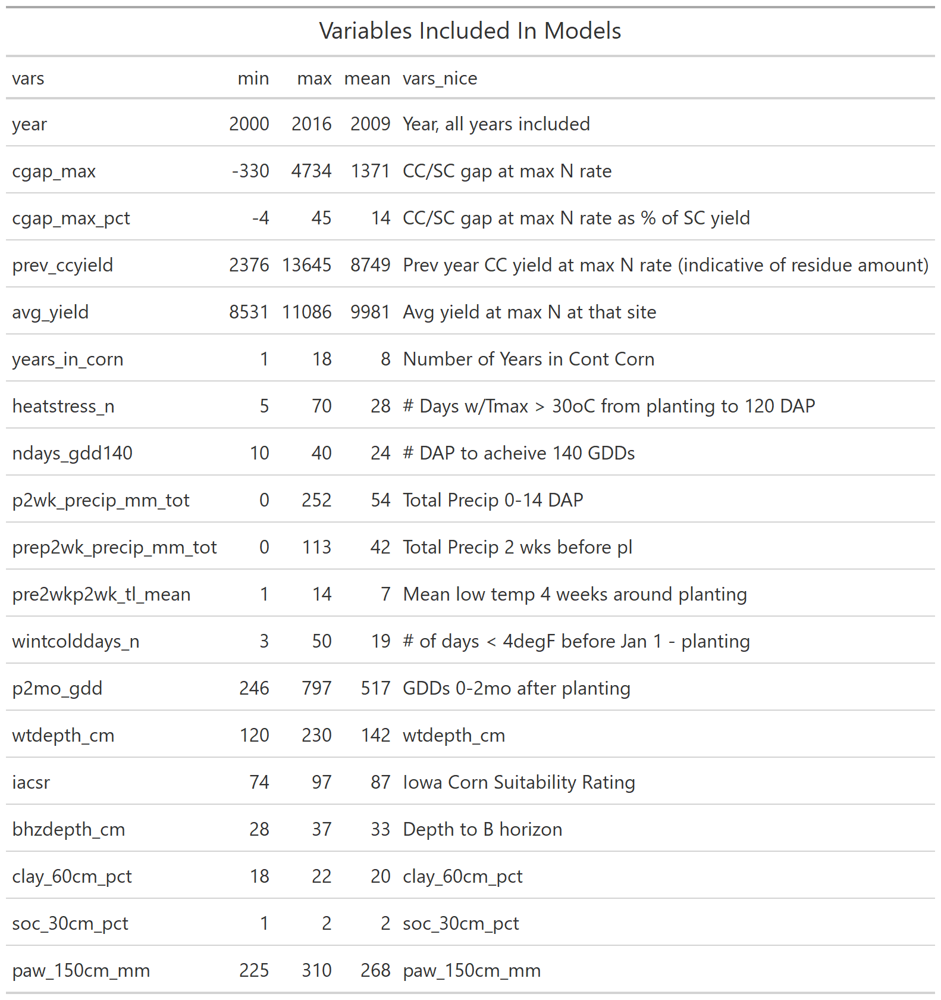

```{r setup, include=FALSE}
knitr::opts_chunk$set(echo = FALSE)
```

## Iowa and Illinois Yields Over Time

```{r yields, out.width='100%'}
knitr::include_graphics("../00_exp-explore/fig_yields-over-time.png")

```

## Yield Gaps

```{r gaps, out.width='100%'}

```


## What variables did we look at in Iowa?

```{r vars, out.width='60%'}


```

## What environments are associated with higher yield gaps?

```{r lasso, out.width='100%'}
knitr::include_graphics("../02_fit-models/fig_lasso-pctgap.png")

```

## Does the penalty increase over time? Lit review


```{r, out.width='100%'}
knitr::include_graphics("../figs/lit_years-in-corn.png")
```


## Possible targets in APSIM?


```{r apsim, out.width='100%', out.height='100%'}
knitr::include_graphics("../03_sims/fig_all-factor-gaps-windmill.png")

```

## Summary and next steps
*Summary:*

- Cold wet springs and hot early growing seasons enhance rotation effect at high N rates
- Penalty is only sensitive to previous year's crop (number of years in corn not important)

*Next:*

- Include IL data in random forest variable selection and LASSO regression
- Implement select changes in APSIM, assess how model performs at other sites w/those changes