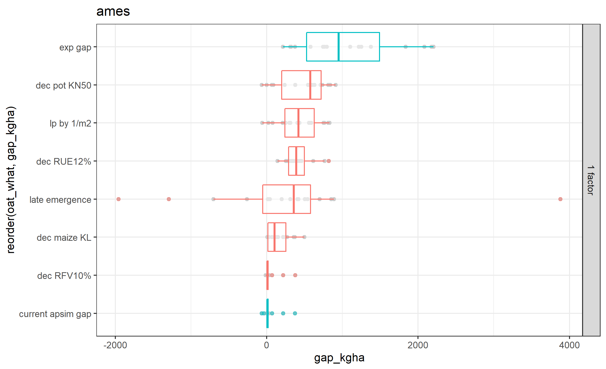

```{r setup, include=FALSE}
knitr::opts_chunk$set(echo = FALSE)
```

## Iowa and Illinois Yields Over Time

```{r yields, out.width='100%'}
knitr::include_graphics("../00_exp-explore/fig_yields-over-time.png")

```

## Yield Gaps

```{r gaps, out.width='100%'}
knitr::include_graphics("../00_exp-explore/fig_yields-over-time.png")

```


## What variables did we look at in Iowa?

```{r lasso, out.height='100%'}
knitr::include_graphics("../01_create-features/tbl_preds-all.png")

```

## What environments are associated with higher yield gaps?

```{r lasso, out.width='100%'}
knitr::include_graphics("../02_fit-models/fig_lasso-pctgap.png")

```

## What are some possible targets in APSIM?


```{r gaps, out.width='100%'}


```
